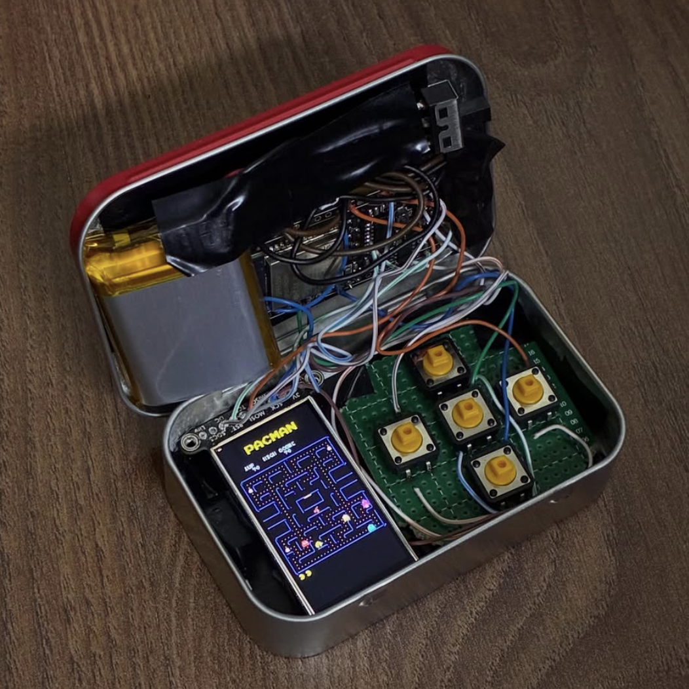
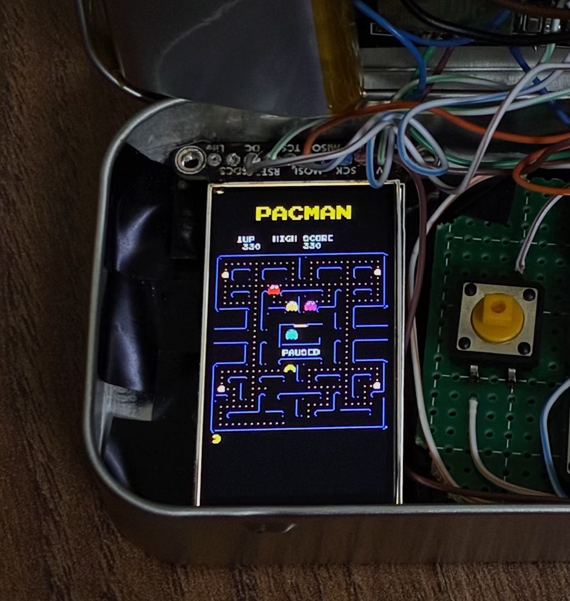
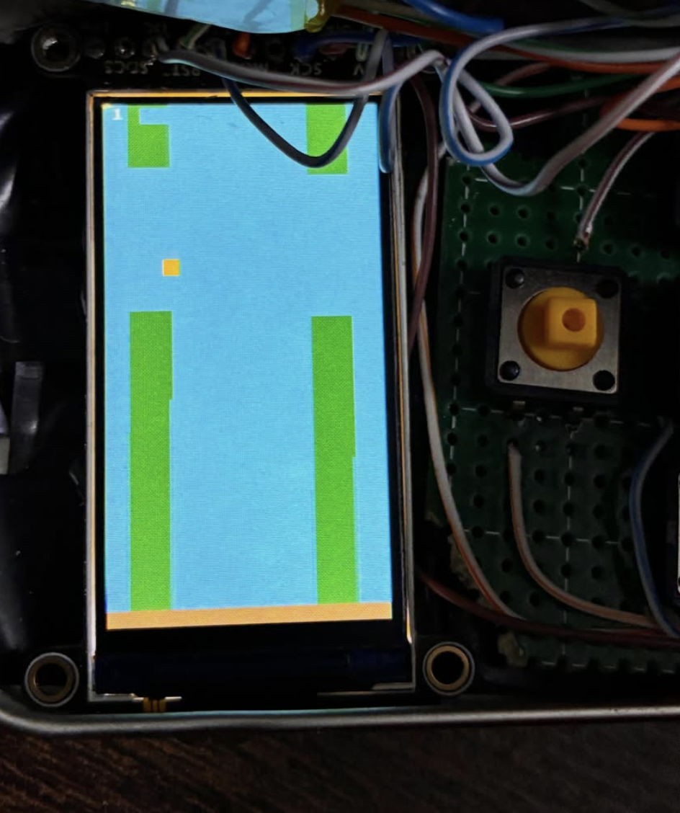
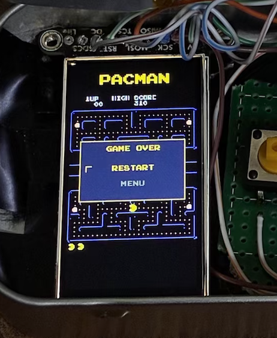
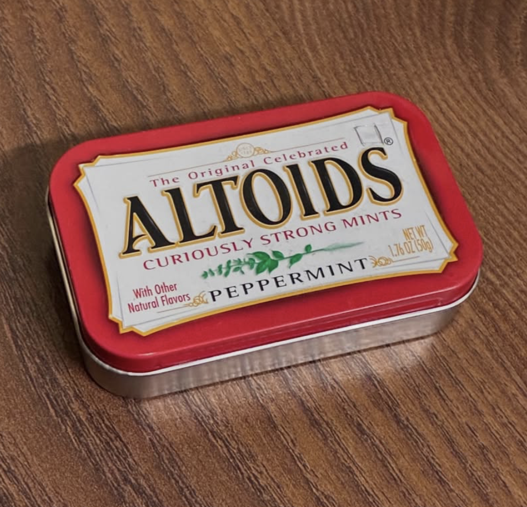

# ESP32 ST7789 Arcade

<p align="center">
  
  
  
</p>
<p align="center">
  
  
</p>

An ESP32 port of the classic Pacman game for a 1.9" ST7789 170×320 display, with an arcade home screen and a Flappy Bird clone.

Originally based on [Pacman-Arduino-Due](https://github.com/DrNCXCortex/Pacman-Arduino-Due) by Dr. NCX, ported through [esp32_ILI9328](https://github.com/Mhage/esp32_ILI9328_Pacman) by Mhage.

---

## Games

- **Pacman** — full maze, ghosts, dots, pills, bonus icons, hi-score
- **Flappy Bird** — physics-based side-scroller, score counter

---

## Hardware

- ESP32 (tested on FireBeetle ESP32 V4.0)
- 1.9" ST7789 SPI TFT display (170×320)
- 5× push buttons (UP, DOWN, LEFT, RIGHT, A)

---

## Wiring / Schematic

> _I'm going to make a schematic on KiCAD later I want to sleep now _

| Signal | ESP32 GPIO |
|--------|-----------|
| SCK    | 18        |
| MOSI   | 23        |
| CS     | 14        |
| DC     | 16        |
| RESET  | 17        |
| BTN A (pause/select) | 26 |
| BTN UP    | 27 |
| BTN DOWN  | 13 |
| BTN LEFT  | 4  |
| BTN RIGHT | 22 |

All buttons are wired active-LOW with `INPUT_PULLUP` — one leg to the GPIO, the other to GND. No external resistors needed.

---

## Libraries

### Main game (`esp32_ST7789_Pacman`)

Uses a **custom bare-metal ST7789 SPI driver** (`ili9328.h` / `ili9328.cpp`) included in the sketch folder — **no library installation needed**.

The driver talks directly to the display over SPI at 40 MHz (SPI_MODE3) without any Adafruit dependency.

> **Column offset:** the ST7789 controller is 240 px wide internally; a 170 px panel is typically wired to columns 35–204. If your display shows a horizontally shifted image, adjust `ST7789_COL_OFFSET` in `ili9328.h`.

### Test sketch (`tft_test`)

Install both via Arduino IDE Library Manager (**Sketch → Include Library → Manage Libraries**):

| Library | Search for |
|---------|-----------|
| Adafruit ST7735 and ST7789 Library | `Adafruit ST7789` |
| Adafruit GFX Library | `Adafruit GFX` |

---

## Flashing

Flash `esp32_ST7789_Pacman/esp32_ST7789_Pacman.ino` from the Arduino IDE.

**Board settings:**
- Board: `ESP32 Dev Module` (or your specific board)
- Upload Speed: `460800`
- Flash Frequency: `80MHz`

---

## Controls

| Button | Home Screen | Pacman | Flappy Bird |
|--------|------------|--------|------------|
| UP / DOWN | Navigate menu | Move | — |
| A | Select game | Pause / unpause | Flap / retry after death |
| RIGHT | — | — | Return to menu |

Serial fallback (for debugging without buttons):

| Key | Action |
|-----|--------|
| `8` | UP |
| `2` | DOWN |
| `4` | LEFT |
| `6` | RIGHT |
| `z` | Pause |
| `x` | Reset |

---

## Test Sketches

Two standalone test sketches are included to help verify hardware before flashing the full game.

### `tft_test/tft_test.ino`

Cycles the display through red → green → blue → black and prints "TFT TEST" on screen. Uses the [Adafruit ST7789 library](https://github.com/adafruit/Adafruit-ST7735-Library) — install it via the Arduino Library Manager before flashing this sketch.

Flash this first to confirm your display and wiring are correct. If the screen fills with solid colours the hardware is good.

### `but_test/but_test.ino`

Prints each button name and GPIO to Serial (115200 baud) when pressed, with debouncing. Tests all five buttons: A (GPIO 26), RIGHT (GPIO 22), UP (GPIO 27), DOWN (GPIO 13), LEFT (GPIO 4).

Open the Serial Monitor after flashing and press each button to confirm it registers. No display required.

---

## Power

The Firebeetle ESP32 V4.0 has an onboard boosting and charging module for LiPos. I connected a 1000mAh 3.7V LiPo to the board via a 3 terminal slide switch. 

For other boards without this functionality, I'm a huge fan of these [Lipo Charge and Boost Modules.](https://robu.in/product/smartelex-lipo-charger-booster-5v-1a/)

---

## Project Structure

```
esp32_ST7789_Pacman/   — main game sketch
  esp32_ST7789_Pacman.ino
  ili9328.h / ili9328.cpp   — custom ST7789 SPI driver
  DrawIndexedMap.h          — tile renderer
  PacmanTiles.h             — sprite & map data
  crntsc.h / crpal.h        — colour palette data
  font8x8.cpp               — 8×8 bitmap font

tft_test/              — display hardware test
  tft_test.ino

but_test/              — button hardware test
  but_test.ino

AUTHORS.txt            — copyright holders
LICENSE.txt            — MIT license
```

---

## License

MIT — see [LICENSE.txt](LICENSE.txt).  
Original game © 2014 Dr. NCX. See [AUTHORS.txt](AUTHORS.txt) for full attribution.
